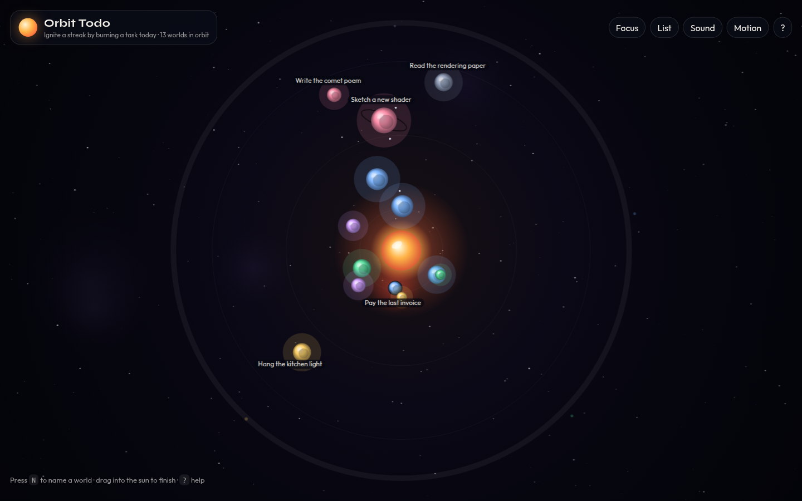
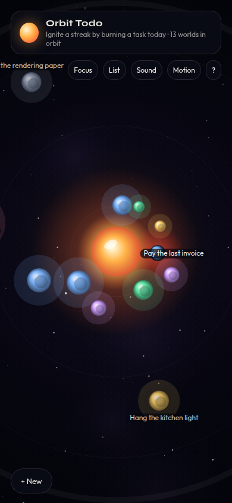

# Orbit Todo

Your tasks are planets. Urgency is gravity. Done is fire.

Most to-do apps are spreadsheets wearing nicer fonts. **Orbit Todo** is a little solar system you keep on a desk: every task is a world, due dates pull them toward a living sun, and finishing something means flinging it into the star until it burns.

[Live demo](https://michaelhabermas.github.io/orbit-todo/) · static, client-side, localStorage only.



<p align="center"></p>

## Why it feels different

- **Size is effort.** Tiny moons of errands, fat gas giants of hard work.
- **Color is a tag.** Work, personal, health, creative, home, and drift each get their own spectrum.
- **Orbit is urgency.** As a due date approaches, the planet spirals inward. Overdue worlds glow red against the corona.
- **Completion is a ritual.** Drag or fling a planet into the sun. It detonates in embers (sound optional).
- **Moons are subtasks.** Hover or click a world to edit it, then hang smaller satellites off it.
- **History is an asteroid belt.** Finished tasks fade to the outer ring so you can browse — or restore — what you have already burned.
- **Capture is instant.** Press `N` or just start typing. Natural language dates like `tomorrow 5pm` and `fri` are first-class, along with `#work` and `!3` for mass.

Extras that stay out of the way: a **stellar streak** if you complete something each day, **focus mode** that zooms the most urgent world, full **keyboard flight**, a toggleable **plain list** for accessibility, and **reduced motion**.

## Fly it

| Input | Action |
| --- | --- |
| `N` or type | Capture a new world |
| Drag / fling into the sun, or `Enter` | Complete the selected task |
| Click a planet | Inspector: due date, tag, effort, moons |
| `←` `→` | Cycle worlds |
| `F` | Focus the most urgent planet |
| `L` | Accessible list view |
| `M` | Mute the sun |
| `R` | Reduced motion |
| `?` | Help |

Capture grammar:

```
Ship the landing page tomorrow 5pm #work !4
```

## Run locally

Needs Node 20+.

```bash
npm install
npm run dev
```

Then open the URL Vite prints (usually `http://localhost:5173`).

```bash
npm test        # date parser + data model
npm run lint
npm run build   # production bundle, GitHub Pages base path applied in CI
```

Data never leaves the browser. Clearing site storage resets the system and reseeds a demo galaxy.

## Deploy

Pushes to `main` build the static site and publish it with GitHub Pages. The workflow calls `actions/configure-pages` with `enablement: true`, so Pages is switched on automatically the first time it runs.

Production URL: [https://michaelhabermas.github.io/orbit-todo/](https://michaelhabermas.github.io/orbit-todo/)

## Stack

Vite + TypeScript + Canvas 2D. No backend, no runtime dependencies. The renderer is built to hold ~60fps with about fifty worlds: cached starfield, capped particles, and labels only for the worlds that matter.
